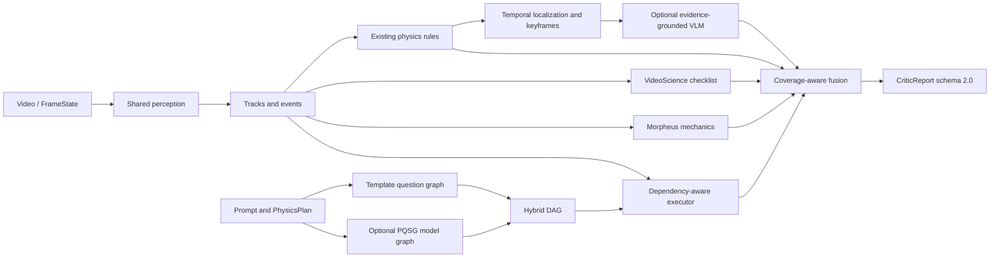

# PAVG Critic

PAVG Critic 是面向生成视频的物理一致性检测器。当前仓库只实现并评估 Critic，不包含视频生成、Repair Agent 或生成闭环。

它保留原有 PAVG 的规则、时序定位和关键帧架构，并在内部融合三类前人工作：

- [PQSG](https://github.com/atinpothiraj/pqsg)：Object → Action → Physics 问题图、父节点失败传播、两阶段 QA 和独立 B0 基线。
- [Morpheus](https://github.com/physics-from-video/Morpheus)：力学适用性门控、invariance score 和 `1 - min(NMSE, 1)` 动力学分数。
- [VideoScience-Bench](https://github.com/hao-ai-lab/VideoScience)：五维检查表、CV 证据、关键帧和覆盖率设计。

详细设计见 [Critic enhancement design](docs/superpowers/specs/2026-07-14-pavg-critic-enhancement-design.md)。

## 当前能力

- 原有五类规则：提前反弹、表面穿透、物体消失、反重力、瞬移。
- 模板问题图与可选 PQSG 模型问题图合并，支持 O→A、O→P、A→A、A→P、P→P。
- VideoScience 五维检查：现象一致性、动力学正确性、时空连续性、物体不变性、交互真实性。
- Morpheus 风格力学评估：自由落体、抛体、反弹、碰撞。
- 规则、PQSG、检查表、力学、VLM 五类统一 `EvidenceBundle`。
- 覆盖感知的 `physical / violation / unknown` 三态输出；无证据不再返回满分。
- DeepSeek 文本模型和 OpenAI Responses/多模态关键帧适配器。
- B0/B1/M1–M5 对比接口、冻结回归夹具和真实视频解码烟雾测试。

## 架构与数据流



节点间只传递冻结 dataclass：`FrameState → TrackSequence → Event → ViolationCandidate → EvidenceBundle → CriticReport`。视频只解码一次，问题图、检查表、力学和 VLM 复用同一批轨迹、事件与关键帧。

## 安装

要求 Python 3.10+。

```powershell
python -m pip install -e ".[test]"
```

真实视频解码：

```powershell
python -m pip install -e ".[video,test]"
```

需要 pandas/scikit-learn 的扩展实验可安装：

```powershell
python -m pip install -e ".[video,evaluation,test]"
```

`pyproject.toml` 是唯一依赖源；CUDA、Torch 和外部视觉模型按各自环境单独安装。

## 无 API 快速运行

仓库提供一组合法“落下—接触—反弹”观察值：

```powershell
pavg-critic `
  --request examples/critic_request.json `
  --observations examples/observations.json `
  --config configs/default.yaml `
  --floor-y 100 `
  --output outputs/example_report.json
```

也可以使用 Python API：

```python
from pavg_critic import CriticRequest, PhysicsCritic, load_config
from pavg_critic.schemas import load_frame_states

critic = PhysicsCritic(load_config("configs/default.yaml"))
request = CriticRequest.from_json("examples/critic_request.json")
report = critic.analyze(
    request,
    observations=load_frame_states("examples/observations.json"),
    floor_y=100,
)
print(report.to_json())
```

若不传 `observations`，Critic 会从 `video_path` 解码视频并运行配置的 detector/tracker。默认 `color_blob` 只适用于受控红球场景；通用视频应注入 GroundingDINO/YOLO、SAM2/ByteTrack 等实现。

## 接入 DeepSeek 或 OpenAI

密钥只放环境变量，不要写进 YAML、代码或提交记录。

DeepSeek 可用于 PQSG 文本问题图：

```powershell
$env:DEEPSEEK_API_KEY="..."
$env:DEEPSEEK_MODEL="deepseek-chat"  # 可省略
```

```python
from pavg_critic import DeepSeekChatModel, PhysicsCritic

critic = PhysicsCritic(question_model=DeepSeekChatModel.from_env())
```

OpenAI 可同时生成 PQSG 图并复核关键帧。模型名必须显式配置，避免默认值随时间漂移：

```powershell
$env:OPENAI_API_KEY="..."
$env:OPENAI_MODEL="<支持结构化输出和图像输入的模型名>"
```

```python
from pavg_critic import (
    EvidenceGroundedVLMVerifier,
    OpenAIResponsesModel,
    PhysicsCritic,
)

model = OpenAIResponsesModel.from_env()
critic = PhysicsCritic(
    question_model=model,
    vlm_verifier=EvidenceGroundedVLMVerifier(model, model_name=model.model),
)
```

没有关键帧时 VLM 不会被调用；默认 `NoOpVLMVerifier` 也不会伪造模型分数。

## 输出语义

`schemas/critic_output.schema.json` 定义 schema 2.0：

- `decision`：`physical`、`violation` 或 `unknown`。
- `physics_score`：融合后的物理可信度，范围 `[0, 1]`。
- `confidence`：实际可用证据经覆盖率折减后的置信度。
- `coverage`：五类证据家族的加权覆盖率。
- `violations`：对象、类别、时间区间、关键帧、理由和修复建议。
- `evidence_bundles`：规则、PQSG、检查表、力学和 VLM 的独立分数/覆盖率/来源。
- `diagnostics`：问题图、VideoScience 五维和 Morpheus 力学明细。

强规则违规会保持 `violation`；无轨迹、无可回答问题且无适用力学时输出 `unknown` 和中性分数 0.5。

## 评估与对比

| 模式 | 内容 | 是否需要模型/API |
|---|---|---|
| B0_PQSG | 官方 PQSG 独立 QG/QA/tree score 输出 | 是 |
| B1_RULE | 原有 PAVG 五类规则 | 否 |
| M1_GRAPH | B1 + PAVG 模板问题图 | 否 |
| M2_CHECKLIST | M1 + VideoScience 五维检查表 | 否 |
| M3_MECHANICS | M2 + Morpheus 力学评估 | 否 |
| M4_VLM | M3 + 关键帧多模态复核 | 是 |
| M5_FULL | M4 + 模型生成 PQSG 混合图 | 是 |

离线回归评估：

```powershell
python benchmarks/evaluate_critic.py --mode B1_RULE
python benchmarks/evaluate_critic.py --mode M3_MECHANICS --output outputs/eval_m3.json
```

指标包括 accuracy、violation precision/recall/F1、unknown rate、平均 coverage 和平均 physics score。仓库内 6 个样例只用于回归，不可作为论文性能结论。

官方 PQSG 结果通过 `load_pqsg_evaluation_records()` 读取，保持 B0 与 PAVG 相互独立：

```python
from pavg_critic.evaluation import compute_metrics, load_pqsg_evaluation_records

records = load_pqsg_evaluation_records("pqsg_results.json", threshold=0.5)
print(compute_metrics(records))
```

外部评估资产放在 git-ignored 的 `evaluation/external/`，来源、大小和 SHA-256 记录于 `evaluation/external_manifest.json`。下载文件按只读处理，不在原文件上写标注或缓存。

## 测试

```powershell
python -m pytest -q
python -m compileall -q src tests benchmarks
python -m json.tool evaluation/external_manifest.json > $null
```

测试覆盖包安装、schema、五类旧规则、PQSG DAG/API、五维检查表、外部 CV 证据、四类力学、证据融合、关键帧 VLM、B0 适配与 B1/M1–M3 评估。

## 仓库结构

```text
src/pavg_critic/       Critic 核心包
tests/                 单元、集成和回归测试
configs/default.yaml   可执行默认配置
schemas/               Critic 2.0 与样本契约
examples/              可直接运行的请求和观察值
evaluation/fixtures/   冻结轨迹评估夹具
evaluation/external_manifest.json
benchmarks/             统一离线评估入口
docs/superpowers/specs/ 已批准的增强设计
```

## 已知限制

- 默认颜色检测器不是开放世界模型，真实 benchmark 必须替换检测/跟踪前端。
- 图像坐标力学分数用于相对一致性评估；若有相机标定、深度或真实尺度，应先转换到世界坐标。
- 碰撞基线暂按等质量、图像平面动量评估；多物体质量与遮挡需由外部证据补充。
- B0、M4、M5 不会在缺少真实模型时降级成伪实验；调用方必须显式提供官方预测或模型适配器。
