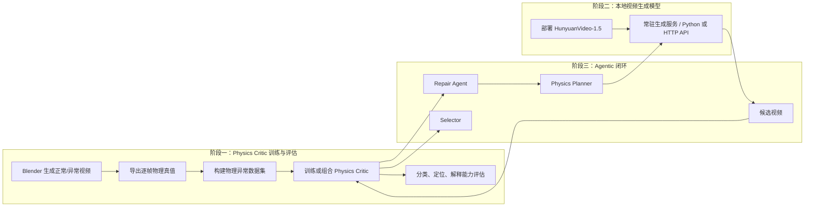
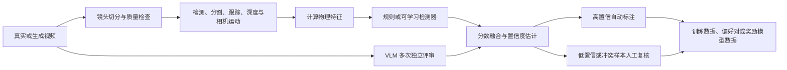
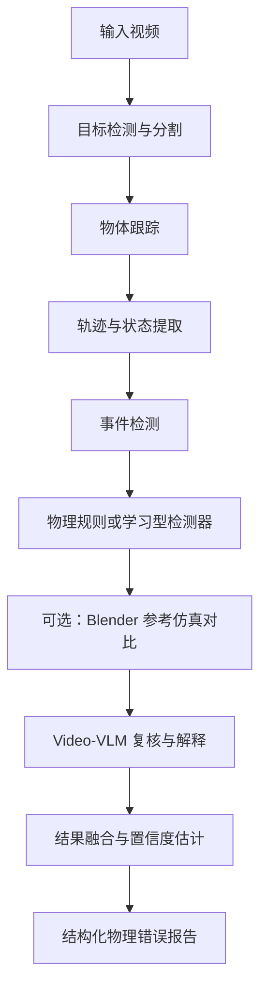

# PAVG：面向物理一致性的 Agentic Video Generation

PAVG（Physics-Aware Agentic Video Generation）旨在提升视频生成模型输出的**物理一致性**。项目通过 Blender 自动构造带精确物理真值的视频数据，训练或组合能够发现、定位并解释物理异常的 `Physics Critic`，再将 Critic 接入本地视频生成模型，形成“规划 - 生成 - 检测 - 反馈 - 修正 - 再生成”的闭环。

> 当前状态：方案设计 / 概念验证阶段。本文档描述目标架构、数据规范和推荐实施路径；仓库中的代码与运行命令将在各模块实现后逐步补齐。

## 目录

- [项目目标](#项目目标)
- [总体架构](#总体架构)
- [Physics Critic](#physics-critic)
- [异常时序与关键帧](#异常时序与关键帧)
- [首期物理异常范围](#首期物理异常范围)
- [数据集与标注规范](#数据集与标注规范)
- [Agentic 生成闭环](#agentic-生成闭环)
- [实验设计与评价指标](#实验设计与评价指标)
- [推荐工程结构](#推荐工程结构)
- [环境与硬件](#环境与硬件)
- [实施路线](#实施路线)
- [风险与质量控制](#风险与质量控制)

## 项目目标

本项目不止判断视频“是否违反物理规律”，而是希望建立一个能够产生**可执行修复反馈**的系统：

1. 自动构造具有逐帧物理真值的正常与异常视频数据。
2. 识别物理异常的类型、对象、时间区间和关键证据帧。
3. 解释异常原因，并把检测结果转换为可供生成模型使用的修正指令。
4. 通过 Best-of-K 和多轮反馈持续提升生成视频的物理一致性。
5. 在提升物理性的同时，尽量保持语义一致性、主体稳定性和视觉质量。

核心研究问题包括：

- 现有视频生成模型最容易出现哪些物理错误？
- Physics Critic 能否准确完成分类、对象定位、时序定位和证据解释？
- 细粒度物理反馈能否提升下一轮视频的物理一致性？
- 多轮反馈是否优于单次提示词增强？
- Critic 的定位与解释质量如何影响最终修复成功率？
- 物理性提升是否会带来画质或语义保持率下降？

## 总体架构

项目分为三个阶段：



### 数据生产与标注闭环

除 Blender 合成数据外，真实视频和生成视频还可通过“视觉检测 + VLM 评审”形成半自动标注闭环：



建议保留每个分支的原始分数、模型版本与评审证据，避免融合后的单一分数掩盖冲突信息。

## Physics Critic

Physics Critic 推荐采用**混合式架构**，结合可解释的视觉/物理规则与 Video-VLM 的语义判断，而不是完全依赖单一大模型。



### 模块职责

| 模块 | 主要职责 | 典型输出 |
| --- | --- | --- |
| Object Detector / Segmenter | 定位视频中的关键对象与支撑面 | bbox、mask、类别、置信度 |
| Object Tracker | 跨帧维持对象身份 | track ID、可见性、遮挡状态 |
| Trajectory Extractor | 提取并平滑位置、速度和加速度 | 2D/可选 3D 轨迹、运动学特征 |
| Event Detector | 识别接触、碰撞、反弹、消失等事件 | 事件类型、帧区间、参与对象 |
| Physics Rule Engine | 检查事件顺序与物理约束 | 规则分数、违规类别、证据 |
| Temporal Localizer | 定位异常开始、峰值和结束帧 | `start_frame`、`peak_frame`、`end_frame` |
| Keyframe Selector | 选择最有判别力的证据帧 | 异常前、开始、峰值、结果帧 |
| VLM Verifier | 独立复核、语义解释与修复建议 | 评审分数、理由、修正指令 |
| Result Fusion | 融合多路证据并估计可靠性 | 物理得分、最终标签、置信度 |

### 推荐输入

```json
{
  "schema_version": "1.0",
  "video_path": "data/sample_001/video.mp4",
  "prompt": "A red ball falls from a table.",
  "physics_plan": {
    "objects": ["red_ball", "table", "floor"],
    "expected_events": ["leave_support", "fall", "floor_contact", "rebound"]
  },
  "reference_simulation": null
}
```

### 推荐输出

```json
{
  "schema_version": "1.0",
  "is_physical": false,
  "physics_score": 0.46,
  "confidence": 0.91,
  "violations": [
    {
      "object": "red_ball",
      "category": "premature_rebound",
      "start_frame": 47,
      "peak_frame": 49,
      "end_frame": 53,
      "critical_frames": [44, 47, 49, 53],
      "reason": "The ball reverses direction before contacting the floor.",
      "repair_instruction": "Keep the ball moving downward until visible floor contact.",
      "evidence": {
        "rules": ["velocity_reversal_before_contact"],
        "detector_score": 0.94,
        "vlm_score": 0.87
      }
    }
  ]
}
```

实现时应统一 `category` / `violation_type` 等字段名称，并对坐标系、帧率、缺失值与置信度含义进行版本化管理。

## 异常时序与关键帧

Critic 需要先为每个对象建立逐帧状态，再从状态序列中提取事件。例如：

```json
{
  "frame": 48,
  "timestamp_sec": 1.6,
  "object": "red_ball",
  "center": [240, 160],
  "bbox": [210, 130, 270, 190],
  "visible": true,
  "distance_to_floor": 18.5,
  "overlap_with_floor": 0.0
}
```

异常判断的关键是比较预期事件顺序和实际视觉事件顺序：

```text
预期：下落 -> 接触地面 -> 反弹
实际：下落 -> 反弹 -> 接触地面
结论：提前反弹
```

关键帧采用事件驱动选择，而不是只做均匀抽帧：

- `F_pre`：异常前最后一个正常帧；
- `F_start`：异常开始帧；
- `F_peak`：异常最明显帧；
- `F_post`：异常发生后的结果帧。

推荐先粗粒度扫描疑似区间，再在候选区间逐帧分析，最后输出关键证据帧。

## 首期物理异常范围

第一阶段聚焦四类易构造、易验证且具有明确视觉证据的异常：

| 类别 | 示例 | 主要证据 |
| --- | --- | --- |
| 重力异常 | 向上掉落、突然悬浮、无外力变向、加速度趋势异常 | 轨迹、速度/加速度方向、支撑状态 |
| 碰撞异常 | 接触前反弹、接触后无响应、碰撞后异常加速或方向错误 | 接触帧、速度反转、碰撞法向 |
| 实体性与穿透 | 穿墙、穿地面、物体互穿、接触前产生响应 | mask 重叠、深度关系、接触/穿透事件 |
| 物体恒存 | 无故消失、遮挡后不再出现、身份变化、瞬移 | track 连续性、遮挡关系、外观一致性 |

后续可扩展到动量与能量、多物体接触、人体-物体交互、流体以及光影一致性。

## 数据集与标注规范

### 单样本目录

```text
sample_001/
├── video.mp4
├── scene.blend
├── config.json
├── trajectory.json
├── contacts.json
├── annotation.json
└── keyframes/
```

### 标注示例

```json
{
  "schema_version": "1.0",
  "sample_id": "gravity_001",
  "source": "blender_synthetic",
  "is_physical": false,
  "violations": [
    {
      "category": "reverse_gravity",
      "object": "red_ball",
      "start_frame": 38,
      "peak_frame": 45,
      "end_frame": 90,
      "critical_frames": [35, 38, 45, 90],
      "expected_rule": "unsupported objects accelerate downward",
      "repair_instruction": "Ensure continuous downward acceleration under gravity."
    }
  ]
}
```

### 数据来源

- Blender 正常物理视频；
- Blender 人为注入异常的视频；
- HunyuanVideo 真实生成错误；
- 少量真实视频，用于泛化测试。

Blender 数据用于可控训练和精确标注，生成模型输出用于领域适配与闭环验证。训练集、验证集和测试集应按**场景模板、对象组合与随机种子分组切分**，避免相似场景泄漏导致指标虚高。

### 质量控制

- 镜头切分后再进行轨迹分析，避免跨镜头误跟踪。
- 记录 Blender、生成模型、检测模型、VLM、提示词和标注规则的版本。
- 高置信且多路证据一致的样本可自动标注；低置信或规则/VLM 冲突样本进入人工复核。
- 保留人工修改前后的标签与审核人信息，支持标注审计。
- 对同一批样本抽取子集进行双人复核，并报告一致性指标。

## Agentic 生成闭环

完整闭环可表示为：

```text
用户提示词
  -> Physics Planner 生成结构化物理计划
  -> HunyuanVideo 生成 K 个候选视频
  -> Physics Critic 检测、定位并解释异常
  -> Repair Agent 生成可执行修正条件
  -> HunyuanVideo 再生成
  -> Selector 从所有历史候选中选择最优结果
```

推荐将 HunyuanVideo 作为常驻服务加载，Agent 通过 Python 或 HTTP 接口重复调用，避免每次请求都重新加载模型。首期优先验证 480p T2V/I2V，再逐步扩展至 720p、超分辨率和 LoRA 微调。

生成接口至少应支持：

```json
{
  "prompt": "A red ball falls from a table.",
  "seed": 42,
  "resolution": "480p",
  "num_frames": 121,
  "num_inference_steps": 50,
  "image_path": null,
  "output_path": "outputs/video.mp4"
}
```

### Selector 与停止条件

Selector 不应只看物理分数，建议综合以下目标：

- 物理一致性；
- 文本-视频语义一致性；
- 视觉质量；
- 主体身份与结构稳定性；
- 新增错误惩罚。

各权重应写入实验配置并参与消融。满足以下任一条件时可停止循环：达到目标物理分数、连续若干轮无提升、出现不可接受的语义/画质退化、达到最大轮数或计算预算上限。

## 实验设计与评价指标

### 对比方法

1. Direct Generation
2. Physics-aware Prompt
3. Best-of-K
4. LLM 一次性 Prompt 改写
5. Critic Feedback Loop
6. LoRA + Critic Feedback Loop
7. Proposed：Physics Planner + Best-of-K + Physics Critic + Repair Agent + 多轮生成

### Physics Critic 指标

| 能力 | 指标 |
| --- | --- |
| 正常/异常判断 | Accuracy、Precision、Recall、Macro-F1、AUROC |
| 异常分类 | Macro-F1、各类别准确率、混淆矩阵 |
| 时序定位 | temporal IoU、起始/结束帧误差 |
| 对象定位 | 目标命中率、bbox/mask IoU、track 命中率 |
| 关键帧选择 | Top-k 命中率、与人工证据帧的距离 |
| 解释与修复建议 | 人工正确率、证据一致性、可执行性评分 |
| 置信度质量 | ECE、Brier Score、风险-覆盖率曲线 |

### 整体 Agent 指标

- 最终物理一致性与物理得分提升；
- 修正成功率、错误减少率和新增错误率；
- 语义保持率、主体稳定性和视觉质量变化；
- 平均循环次数、平均生成时间、峰值显存和总算力消耗；
- 在相同计算预算下相对 Direct Generation / Best-of-K 的增益。

所有闭环实验应固定模型版本，并同时报告固定种子结果与多种子均值/方差。

## 推荐工程结构

```text
PAVG/
├── configs/                    # 数据、模型、实验与服务配置
├── dataset/
│   ├── blender_generator/      # Blender 场景与异常注入脚本
│   ├── annotations/            # 标注规范、校验与转换工具
│   └── generated_videos/       # 本地或外部生成视频索引
├── critic/
│   ├── detector.py
│   ├── tracker.py
│   ├── trajectory.py
│   ├── event_detector.py
│   ├── physics_rules.py
│   ├── temporal_localizer.py
│   ├── keyframe_selector.py
│   ├── vlm_verifier.py
│   └── fusion.py
├── generator/
│   ├── hunyuan_pipeline.py
│   ├── generator_server.py
│   └── schemas.py
├── agents/
│   ├── planner.py
│   ├── repairer.py
│   ├── selector.py
│   └── controller.py
├── evaluation/
│   ├── critic_metrics.py
│   ├── generation_metrics.py
│   └── human_evaluation.py
├── experiments/
│   ├── critic_benchmark.py
│   ├── feedback_ablation.py
│   └── end_to_end_loop.py
├── tests/
├── outputs/
└── README.md
```

建议让原始大文件、模型权重和生成视频存放在仓库外部或对象存储中，Git 仅跟踪元数据、配置、少量示例和可复现实验脚本。

## 环境与硬件

### 软件基础

- Linux（推荐 Ubuntu）
- Python、PyTorch、CUDA
- Blender 与 Blender Python API
- OpenCV、NumPy
- 目标检测、分割、跟踪与 Video-VLM 相关依赖
- HunyuanVideo-1.5 或兼容的视频生成服务

后续落地时应提供锁定版本的环境文件，并在启动前校验 CUDA、PyTorch、Blender 和模型权重版本。

### 推荐硬件

- NVIDIA GPU：至少 16 GB 显存，推荐 24 GB 以上；
- 内存：至少 32 GB，推荐 64 GB；
- 硬盘：至少 200 GB 可用空间。

若显存不足，可先完成 Blender 数据生成和轻量规则 Critic，视频生成模型使用云 GPU、CPU/GPU 卸载或 480p 模式。

## 实施路线

- [ ] 生成正常小球下落与“提前反弹”异常样例，并导出逐帧真值。
- [ ] 使用 OpenCV 提取红球轨迹，定位接触帧、速度反转帧、异常区间和关键帧。
- [ ] 扩展至穿地面、穿墙、突然消失和反弹高度异常。
- [ ] 批量生成 Blender 数据集及 JSON 标注，并实现 schema 校验。
- [ ] 构建规则版 Physics Critic，并与零样本 Video-VLM 做基线对比。
- [ ] 训练或微调学习型 Critic，完成多路分数融合与置信度校准。
- [ ] 本地部署 HunyuanVideo-1.5，打通单次生成与常驻服务接口。
- [ ] 跑通最小闭环：Prompt -> Generator -> Critic -> Repair -> Regeneration。
- [ ] 增加 Best-of-K、多轮循环、Selector 与完整消融实验。
- [ ] 评估物理性提升与语义/画质退化之间的权衡。

## 风险与质量控制

| 风险 | 影响 | 建议措施 |
| --- | --- | --- |
| 2D 视觉特征不足以恢复真实物理参数 | 规则误判 | 使用事件顺序和相对量，必要时引入深度、相机运动估计与参考仿真 |
| Blender 与生成视频存在域差异 | 合成集表现高、真实生成错误泛化差 | 混合生成模型输出、真实视频和人工复核样本，进行领域适配 |
| VLM 幻觉或多次评审不稳定 | 解释与标签不可信 | 强制证据帧引用、多次独立评审、分数校准与冲突样本人工复核 |
| Critic 奖励被生成器“钻空子” | 分数提高但视频质量下降 | 多指标 Selector、保留人工评测、使用不可见测试 Critic |
| 多轮修复导致语义漂移 | 原始意图或主体变化 | 将语义保持设为硬约束，保存历史最优候选并允许提前停止 |
| 训练/测试场景泄漏 | 指标虚高 | 按场景模板和对象组合分组切分，保留跨域测试集 |

## 项目定位

项目的核心贡献不在于单独调用 Blender 或视频生成模型，而在于建立一条可验证的研究链路：

1. 自动构建细粒度、带物理真值的异常视频数据；
2. 准确定位异常对象、时序区间与关键证据帧；
3. 将检测和解释结果转换为可执行的生成修正反馈；
4. 通过对照与消融实验验证物理反馈对生成质量的真实增益。

## License

许可证尚未确定。在明确开源范围前，请勿默认将数据、模型权重或第三方素材用于再分发。
