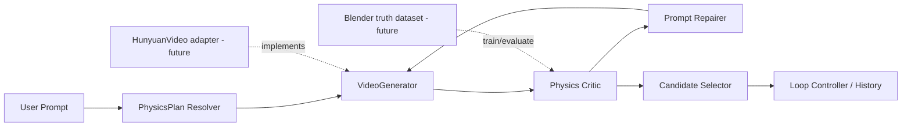
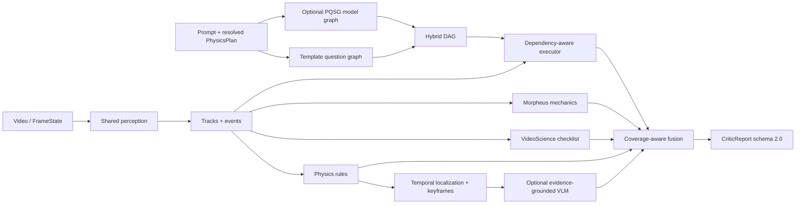

# PhysGenLoop

PhysGenLoop 面向生成视频的物理一致性增强：先把用户提示解析为结构化物理计划，再生成候选视频，用 Physics Critic 检测、定位和解释物理异常，最后根据结构化反馈修正提示并选择历史最优结果。

当前仓库已经具备可运行的 **Physics Planner + Physics Critic**，并搭好了 **Generator / Repairer / Selector / Loop Controller** 的轻量编排框架。真实 HunyuanVideo、Blender 数据生成和学习型 Repair Agent 尚未接入。

## 当前状态

| 层级 | 状态 | 当前实现 |
|---|---|---|
| Prompt → PhysicsPlan | 已实现 | 中英文模板、结构化模型、显式计划合并、provider 回退与审计 |
| Physics Critic | 已实现 | 轨迹/事件、规则、PQSG、VideoScience、Morpheus、关键帧 VLM 与证据融合 |
| Loop orchestration | 框架已搭 | 冻结契约、deterministic fake generator、Repairer、Selector、有界 Best-of-K |
| HunyuanVideo | 尚未实现 | 后续通过 `VideoGenerator` 协议接入常驻生成服务 |
| Blender 数据管线 | 尚未实现 | 后续生成正常/异常视频、逐帧真值和关键帧标注 |
| 学习型 Repair / Critic 训练 | 尚未实现 | 当前修复策略为结构化 instruction 聚合，Critic 以规则和可选模型组合为主 |

## 最新整体架构



总控数据流为：

```text
Prompt
  → resolved PhysicsPlan
  → Best-of-K candidate videos
  → CriticReport for each candidate
  → select current best
  → accepted / max_rounds / repaired next prompt
```

循环始终受 `max_rounds` 和 `candidates_per_round` 限制，不允许无限重试。每轮保留 prompt、seed、候选、CriticReport 和选择结果，便于复现实验。

### Physics Critic 内部数据流



Critic 节点间传递冻结 dataclass：`FrameState → TrackSequence → Event → ViolationCandidate → EvidenceBundle → CriticReport`。视频只解码一次，问题图、检查表、力学和 VLM 复用轨迹、事件与关键帧。

## 安装

要求 Python 3.10+。推荐使用独立虚拟环境：

```powershell
py -3.12 -m venv .venv
.\.venv\Scripts\Activate.ps1
python -m pip install -e ".[test]"
```

需要真实视频解码时：

```powershell
python -m pip install -e ".[video,test]"
```

`pyproject.toml` 是唯一依赖源。CUDA、Torch、HunyuanVideo 和外部视觉模型按实际部署环境单独安装。

## 1. Prompt → PhysicsPlan

不配置 API 时，Critic 使用确定性中英文模板 Planner：

```python
from pavg_critic import CriticRequest, PhysicsCritic

critic = PhysicsCritic()
request = CriticRequest(
    video_path="video.mp4",
    prompt="一个红球从桌面掉落，接触地面后反弹。",
)
report = critic.analyze(request)
```

Planner 会保守解析对象、事件、关系和物理约束，例如：

```text
objects: red_ball, table, floor
events: leave_support → fall → floor_contact → rebound
constraints: gravity, contact, rebound
```

完整显式 `objects + expected_events` 会跳过 Planner 调用；部分显式计划会保留非空核心字段，并补全空字段。所有下游模块共用同一个 resolved request，结果记录于 `diagnostics.planner`。

### 使用结构化模型 Planner

同一个模型可同时用于 PhysicsPlan 与 PQSG：

```python
from pavg_critic import OpenAIResponsesModel, PhysicsCritic

model = OpenAIResponsesModel.from_env()
critic = PhysicsCritic(question_model=model)
```

当计划核心不完整时，上述方式会先生成 PhysicsPlan，再生成 PQSG 图。也可以分离两个模型：

```python
critic = PhysicsCritic(
    planner_model=planner_model,
    question_model=question_graph_model,
)
```

模型 Planner 超时、网络失败或返回非法 schema 时会记录 `physics_planner` provider failure，并回退到模板 Planner；用户显式输入的非法计划不会被静默修复。

## 2. 无 API 运行 Critic

仓库提供合法“下落—接触—反弹”观察值，可跳过视频解码：

```powershell
pavg-critic `
  --request examples/critic_request.json `
  --observations examples/observations.json `
  --config configs/default.yaml `
  --floor-y 100 `
  --output outputs/example_report.json
```

Python API：

```python
from pavg_critic import CriticRequest, PhysicsCritic, load_config
from pavg_critic.schemas import load_frame_states

critic = PhysicsCritic(load_config("configs/default.yaml"))
report = critic.analyze(
    CriticRequest.from_json("examples/critic_request.json"),
    observations=load_frame_states("examples/observations.json"),
    floor_y=100,
)
print(report.to_json())
```

若不传 `observations`，Critic 会从 `video_path` 解码并运行 detector/tracker。默认 `color_blob` 只适用于受控红球场景；通用视频必须注入真实检测、分割和跟踪实现。

## 3. 最小闭环框架

`physgenloop` 包提供以下稳定边界：

- `VideoGenerator`：由 prompt、resolved PhysicsPlan 和 seed 生成候选引用；
- `CandidateCritic`：把候选转换为 `CriticReport`；
- `PromptRepairer`：把结构化违规转换为下一轮 prompt；
- `CandidateSelector`：稳定选择当前或历史最佳候选；
- `LoopController`：执行有界 Best-of-K 多轮循环。

下面的示例完全在 CPU 上运行，用 fake generator 和脚本 Critic 验证编排；它不会创建真实 MP4：

```python
from pavg_critic.schemas import CriticReport
from physgenloop import (
    DeterministicFakeGenerator,
    EvidenceAwareSelector,
    InstructionPromptRepairer,
    LoopConfig,
    LoopController,
)


class AlwaysPhysicalCritic:
    def evaluate(self, candidate, *, prompt, physics_plan):
        return CriticReport(
            is_physical=True,
            decision="physical",
            physics_score=0.95,
            confidence=0.9,
        )


controller = LoopController(
    generator=DeterministicFakeGenerator(),
    critic=AlwaysPhysicalCritic(),
    repairer=InstructionPromptRepairer(),
    selector=EvidenceAwareSelector(),
    config=LoopConfig(max_rounds=3, candidates_per_round=2),
)
result = controller.run(prompt="A red ball falls and bounces.")
print(result.stop_reason, result.best.candidate.candidate_id)
```

接入真实生成器时，实现 `VideoGenerator.generate()` 并返回真实 `video_path`，再用 `PhysicsCriticAdapter(PhysicsCritic(...))` 接入现有 Critic。

## Critic 输出语义

`schemas/critic_output.schema.json` 定义 schema 2.0：

- `decision`：`physical`、`violation` 或 `unknown`；
- `physics_score`：融合后的物理可信度，范围 `[0, 1]`；
- `confidence`：可用证据经覆盖率折减后的置信度；
- `coverage`：规则、PQSG、检查表、力学和 VLM 的加权覆盖率；
- `violations`：对象、类别、时间区间、关键帧、理由和修复建议；
- `evidence_bundles`：各证据家族的独立状态、分数、覆盖率和来源；
- `diagnostics`：Planner、问题图、VideoScience、Morpheus 和 provider failure 明细。

无轨迹、无可回答问题且无适用力学时返回 `unknown` 和中性分数，而不是伪造满分。

## 评估

| 模式 | 内容 | 模型/API |
|---|---|---|
| B0_PQSG | 官方 PQSG 独立输出 | 需要 |
| B1_RULE | PAVG 五类确定性规则 | 不需要 |
| M1_GRAPH | B1 + 模板问题图 | 不需要 |
| M2_CHECKLIST | M1 + VideoScience 五维检查表 | 不需要 |
| M3_MECHANICS | M2 + Morpheus 力学评估 | 不需要 |
| M4_VLM | M3 + 关键帧多模态复核 | 需要 |
| M5_FULL | M4 + 模型生成 PQSG 混合图 | 需要 |

```powershell
python benchmarks/evaluate_critic.py --mode B1_RULE
python benchmarks/evaluate_critic.py --mode M3_MECHANICS --output outputs/eval_m3.json
```

仓库内小样例只用于回归，不可作为论文性能结论。

## 仓库结构

```text
src/
├── pavg_critic/                 已实现的 Planner + Physics Critic
│   ├── planner.py               template/model Planner 与 Resolver
│   ├── pipeline.py              Critic 主流水线
│   ├── detector.py              可替换视觉前端
│   ├── tracker.py               目标跟踪
│   ├── trajectory.py            轨迹提取
│   ├── event_detector.py        事件检测
│   ├── physics_rules.py         物理规则
│   ├── temporal_localizer.py    异常时序定位
│   ├── keyframe_selector.py     证据关键帧
│   ├── vlm_verifier.py          可选多模态复核
│   └── evidence_fusion.py       覆盖感知证据融合
└── physgenloop/                 新增的跨组件编排骨架
    ├── contracts.py             循环配置、候选、轮次与结果
    ├── interfaces.py            Generator/Critic/Repairer/Selector 协议
    ├── generator.py             deterministic fake generator
    ├── critic_adapter.py        PhysicsCritic 边界适配器
    ├── repairer.py              repair instruction 聚合
    ├── selector.py              稳定候选排序
    └── controller.py            有界 Best-of-K 循环

tests/                           单元、集成和回归测试
configs/default.yaml             Critic 默认配置
schemas/                         Critic 2.0 与样本契约
examples/                        可直接运行的请求和观察值
evaluation/fixtures/             冻结轨迹评估夹具
benchmarks/                      统一离线评估入口
docs/superpowers/specs/          架构与功能设计
docs/superpowers/plans/          可执行实施计划
```

## 测试

```powershell
python -m pytest -q
python -m compileall -q src tests benchmarks
python -m pip check
python -m json.tool evaluation/external_manifest.json > $null
```

## 路线图

1. **当前：Planner + Critic + orchestration shell**
   - prompt-only PhysicsPlan；
   - 混合 Critic 与证据融合；
   - deterministic Best-of-K 闭环。
2. **数据阶段：Blender/Kubric**
   - 正常与异常物理场景；
   - 逐帧轨迹、接触、时序区间和关键帧真值；
   - 训练/验证/测试拆分与数据版本管理。
3. **生成阶段：HunyuanVideo adapter**
   - 480p T2V/I2V 常驻服务；
   - seed、帧数、推理步数和输出路径控制；
   - 显存、超时和失败审计。
4. **闭环阶段：真实 Repair + Selector**
   - 结构化 repair prompt；
   - 多候选与多轮停止条件；
   - 语义保持、画质变化和新增错误率评估。
5. **研究阶段：训练与消融**
   - Critic 学习模块或 LoRA；
   - Direct / Physics-aware / Best-of-K / Feedback Loop 对比；
   - temporal IoU、关键帧命中率和修复成功率。

## 已知限制

- deterministic fake generator 只用于测试编排，不生成视频；
- 默认颜色检测器不是开放世界模型，真实 benchmark 必须替换视觉前端；
- 图像坐标力学分数主要用于相对一致性评估，真实尺度需要相机标定或深度；
- 当前 Prompt Repairer 只聚合 Critic 的修复指令，尚不是学习型 Agent；
- B0、M4、M5 在缺少真实模型时不会伪造实验结果；
- 当前循环为同步单机骨架，不含服务队列、GPU 调度、断点恢复或持久化数据库。

## 设计文档

- [整体架构骨架设计](docs/superpowers/specs/2026-07-15-physgenloop-overall-architecture-design.md)
- [Prompt → PhysicsPlan Planner 设计](docs/superpowers/specs/2026-07-15-prompt-physics-plan-design.md)
- [Physics Critic 增强设计](docs/superpowers/specs/2026-07-14-pavg-critic-enhancement-design.md)
- [部署与操作指南](docs/operation-guide.md)
