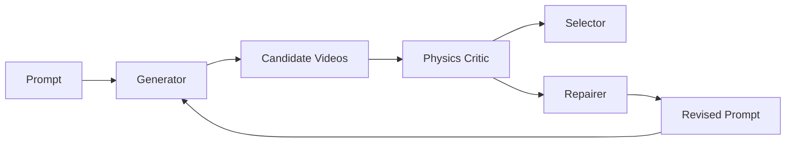

# 仓库清理实施计划

> **For agentic workers:** REQUIRED SUB-SKILL: Use superpowers:subagent-driven-development (recommended) or superpowers:executing-plans to implement this plan task-by-task. Steps use checkbox (`- [ ]`) syntax for tracking.

**Goal:** 在不丢失当前功能和本地资源的前提下，整理仓库根目录、重构 README 的整体框架表达、验证全部改动，并快进推送到远端 `main`。

**Architecture:** 保持 `src/pavg_critic` 物理评估层与 `src/physgenloop` 闭环编排层的代码边界不变，只调整入口示例、归档文档、忽略规则和 README 信息架构。所有数据、模型、视频、环境和 IDE 配置保留在本机；Git 只接收源码、测试、元数据、示例和文档。

**Tech Stack:** Python 3.12、setuptools、pytest、Git、Markdown、Mermaid

---

### Task 1: 固化清理边界和远端基线

**Files:**
- Inspect: all tracked and untracked repository paths
- Preserve: `.env`, `.venv`, `.idea`, `.vscode`, `.agents`, `.claude`, `evaluation/external`, `outputs`, `*.mp4`

- [ ] **Step 1: 获取最新远端引用并验证线性关系**

Run:

```powershell
git fetch --prune origin
git rev-list --left-right --count origin/main...HEAD
```

Expected: 左侧为 `0`，表示远端 `main` 没有当前分支缺失的提交。

- [ ] **Step 2: 保存清理前状态清单**

Run:

```powershell
git status --short --branch
git diff --stat
git diff --cached --stat
git clean -ndX
```

Expected: 当前功能改动完整可见；删除预览只包含被忽略的本机文件。

### Task 2: 整理仓库根目录

**Files:**
- Move: `test.py` → `examples/evaluate_video.py`
- Move: `项目总体思路(2).pdf` → `docs/archive/project-overview.pdf`

- [ ] **Step 1: 验证源文件和目标目录**

Run:

```powershell
Resolve-Path test.py
Resolve-Path '项目总体思路(2).pdf'
New-Item -ItemType Directory -Force examples, docs/archive
```

Expected: 两个源文件位于仓库根目录；目标目录位于仓库内部。

- [ ] **Step 2: 移动可执行示例与归档文档**

Run:

```powershell
Move-Item -LiteralPath test.py -Destination examples/evaluate_video.py
Move-Item -LiteralPath '项目总体思路(2).pdf' -Destination docs/archive/project-overview.pdf
```

Expected: 根目录不再包含 `test.py` 和 PDF，内容出现在职责明确的新路径。

- [ ] **Step 3: 验证 Git 识别为移动**

Run:

```powershell
git status --short
git diff --summary
```

Expected: Git 能在暂存后识别两个文件的重命名或等价的删除/新增。

### Task 3: 完善忽略规则

**Files:**
- Modify: `.gitignore`

- [ ] **Step 1: 更新 Python、环境和工具缓存规则**

将环境段调整为以下规则，并保留现有大文件、IDE 和 worktree 规则：

```gitignore
__pycache__/
*.py[cod]
*.egg-info/
build/
dist/
.pytest_cache/
.mypy_cache/
.ruff_cache/
.tox/
.coverage
htmlcov/
.venv/
venv/
.env
.env.*
!.env.example
*.log
```

- [ ] **Step 2: 验证环境模板与真实环境文件的跟踪策略**

Run:

```powershell
git check-ignore -v .env
git check-ignore -v .env.example
```

Expected: `.env` 被忽略；`.env.example` 命中否定规则并可被版本控制。

### Task 4: 将 README 重构为整体框架入口

**Files:**
- Modify: `README.md`

- [ ] **Step 1: 按固定顺序重排一级和二级章节**

README 使用以下信息架构：

```text
# PhysGenLoop
## 项目定位
## 当前能力
## 整体闭环
## 分层架构
## Physics Critic 数据流
## 仓库结构
## 安装与环境配置
## 快速开始
## 评测与结果
## 测试
## 已知限制
## 路线图
## 设计与开发文档
```

合并重复的安装、API 配置和使用说明；先给最短运行路径，再给 Planner、无 API Critic、视频评估和闭环示例。

- [ ] **Step 2: 写入与代码一致的整体闭环图**

使用 Mermaid 表达以下已实现/占位关系，并明确 Generator 与学习型 Repairer 尚未接入真实生成模型：



- [ ] **Step 3: 写入分层边界和 Critic 数据流**

准确说明：

```text
physgenloop: Generator/Critic adapter/Selector/Repairer/Controller 编排
pavg_critic: PhysicsPlan → Observation → 轨迹与事件 → 规则/问题图/力学 → VLM 复核 → 证据融合 → CriticReport
```

不得把尚未实现的真实生成器、学习型修复器或大规模 benchmark 结果描述为已完成。

- [ ] **Step 4: 更新所有迁移后的路径和结果链接**

Run:

```powershell
rg -n 'test\.py|项目总体思路\(2\)\.pdf' README.md docs src tests examples
```

Expected: 运行命令使用 `examples/evaluate_video.py`；归档链接使用 `docs/archive/project-overview.pdf`；历史设计文档中的原始讨论可保留原文件名文字。

### Task 5: 清理可再生本机缓存

**Files:**
- Delete locally: `.pytest_cache`, repository `__pycache__` directories, `src/*.egg-info`
- Preserve all paths listed in Task 1

- [ ] **Step 1: 解析并检查每个删除目标位于仓库内部**

Run:

```powershell
$root = (Resolve-Path .).Path
Get-ChildItem -Path $root -Recurse -Force -Directory | Where-Object {
  $_.Name -eq '__pycache__' -or $_.Name -like '*.egg-info'
} | Select-Object -ExpandProperty FullName
Resolve-Path .pytest_cache -ErrorAction SilentlyContinue
```

Expected: 所有目标的绝对路径均以仓库根路径开头，且不包含 `.venv`。

- [ ] **Step 2: 使用 PowerShell 原生命令删除已验证缓存**

只对 Step 1 中已验证、位于仓库内部且不在 `.venv` 的缓存调用 `Remove-Item -Recurse -Force -LiteralPath`。单独删除仓库根目录 `.pytest_cache`。不得删除 `.env`、`.venv`、评测数据、输出、视频或 IDE 配置。

### Task 6: 验证功能、结构和凭据卫生

**Files:**
- Verify: `src/`, `tests/`, `examples/evaluate_video.py`, tracked documentation

- [ ] **Step 1: 运行完整测试**

Run:

```powershell
$env:PYTHONPATH='src'
New-Item -ItemType Directory -Force .pytest_cache | Out-Null
.venv\Scripts\python.exe -m pytest -q --basetemp=.pytest_cache\tmp
```

Expected: `159 passed` 或更多，零失败。

- [ ] **Step 2: 编译源码与示例**

Run:

```powershell
.venv\Scripts\python.exe -m compileall -q src examples/evaluate_video.py
.venv\Scripts\python.exe examples/evaluate_video.py --help
```

Expected: 两个命令退出码均为 `0`，帮助文本显示视频评估参数。

- [ ] **Step 3: 验证 README 路径、根目录和忽略规则**

Run:

```powershell
Get-ChildItem -Force
Test-Path examples/evaluate_video.py
Test-Path docs/archive/project-overview.pdf
git check-ignore -q .env
git check-ignore .env.example
```

Expected: 新路径存在；旧路径不存在；`.env` 被忽略；`.env.example` 未被排除。

- [ ] **Step 4: 扫描将要提交的内容是否疑似包含凭据**

Run a redacted scanner over `git diff --cached` and tracked text that reports only file path, line number, and pattern category for assignments resembling private keys, access tokens, passwords, or non-empty API keys. Allow empty/example placeholders in `.env.example`; fail on private-key blocks or plausible live credential values.

Expected: 零个疑似真实凭据。

### Task 7: 审查、提交并快进推送 main

**Files:**
- Commit: all approved feature, result, cleanup, plan, and documentation changes
- Push: local `HEAD` → `origin/main`

- [ ] **Step 1: 审查最终差异与文件清单**

Run:

```powershell
git status --short
git diff --check
git diff --stat HEAD
git diff --name-status HEAD
```

Expected: 没有空白错误；只包含已批准的代码、示例、文档、清单和结构变更。

- [ ] **Step 2: 创建职责清晰的提交**

先提交当前 VLM/API/benchmark 结果工作，再提交结构清理与 README；不得提交 `.env`、视频、模型、外部数据或生成输出。

Run:

```powershell
git add <reviewed-feature-paths>
git commit -m "feat: add general VLM video evaluation"
git add <reviewed-cleanup-paths>
git commit -m "chore: organize repository structure"
```

Expected: 工作区除受保护的被忽略本机资源外保持干净。

- [ ] **Step 3: 最终验证后检查远端快进条件**

Run:

```powershell
git fetch --prune origin
git rev-list --left-right --count origin/main...HEAD
git merge-base --is-ancestor origin/main HEAD
```

Expected: 左侧为 `0`，祖先检查退出码为 `0`。

- [ ] **Step 4: 推送并验证远端 main**

Run:

```powershell
git push origin HEAD:main
git fetch origin main
if ((git rev-parse HEAD) -ne (git rev-parse origin/main)) { throw 'origin/main mismatch' }
```

Expected: 非强制推送成功，`HEAD` 与 `origin/main` SHA 完全一致。
