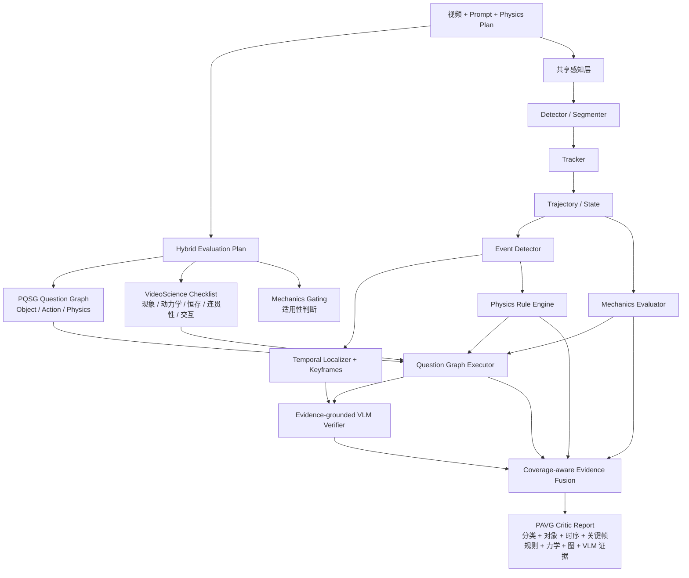

# PAVG Physics Critic 提升设计

日期：2026-07-14  
状态：设计已由用户逐节确认，等待书面复核  
范围：只建设 Physics Critic，不建设视频生成、Repair Agent、Selector 或生成闭环

## 1. 背景与目标

PAVG 当前已经具备一条可运行的规则型 Physics Critic 主链：视频或预计算状态经过检测、跟踪、轨迹提取、事件检测、物理规则、时序定位、关键帧选择、可选 VLM 复核与结果融合，最终输出结构化异常报告。现有代码还实现了基于 Physics Plan 的 Object/Action/Physics 问题图、依赖执行和图评分。

本次提升不以 PQSG 或其他外部项目替换现有架构。目标是在 PAVG 主链内吸收三项参考工作的优势：

- PQSG：层次问题图、VLM 问答、前向依赖传播和图评分；
- Morpheus：受控牛顿力学场景中的守恒量检查与动力学方程拟合；
- VideoScience-Bench：prompt-specific checklist、CV-grounded evidence、显著关键帧和五维科学评价。

最终系统应同时具备：

1. 正常/异常与异常类别判断；
2. 异常对象、轨迹身份、时间区间和关键帧定位；
3. 规则、力学、问题图、CV 和 VLM 多路可审计证据；
4. `physical / violation / unknown` 三态决策；
5. 可执行但有证据约束的修复建议；
6. 与纯 PQSG 的独立实验对比；
7. 可复现、可消融、可扩展的 Critic 工程结构。

## 2. 非目标

本轮明确不实现：

- HunyuanVideo 或其他视频生成器；
- Planner、Repair Agent、Selector、Controller；
- Best-of-K 或多轮生成闭环；
- 视频局部重绘、提示词修复或 LoRA；
- 将 PQSG、Morpheus 或 VideoScience 整仓复制进本项目；
- 在没有适用性判断的情况下对任意视频强制计算牛顿力学分数。

## 3. 参考依据与采用边界

### 3.1 PQSG

参考：

- 论文：https://arxiv.org/abs/2606.25306v1
- 仓库：https://github.com/atinpothiraj/pqsg

采用：

- Object、Action、Physics 三类问题节点；
- 问题依赖 DAG；
- O→A、O→P、A→A、A→P、P→P 前向依赖；
- 两阶段 QA，即先产生证据解释，再约束 yes/no；
- 父节点失败向后传播的 tree score；
- 分类评分和人类相关性评估。

不采用：

- 以 PQSG 作为整个 PAVG Critic 的主骨架；
- 仅依赖 VLM 回答所有问题；
- 用一个图总分替代异常对象、时序和关键帧报告。

纯 PQSG 仅作为最终外部 baseline。PAVG 内部使用 PQSG-compatible 的问题图能力，但节点可以由规则、事件、力学或 VLM 验证。

### 3.2 Morpheus

参考：

- 论文：https://arxiv.org/abs/2504.02918v3
- 仓库：https://github.com/physics-from-video/Morpheus

采用：

- 物理现象 taxonomy 和适用性路由；
- 滑动时间窗口内的能量、动量、周期、距离等不变量检查；
- 基于物理方程拟合误差的 Dynamical Score；
- `1 - min(NMSE, 1)` 风格的可解释归一化；
- 受控场景和中间量可审计原则。

不采用：

- 首期完整移植全部 PINN、SAM2 和实验代码；
- 对开放世界视频无条件运行力学评价；
- 把不适用或失败解释为物理零分。

首期只覆盖自由落体、抛体、反弹和两物体碰撞。摆和弹簧留到首期结果证明力学分支有效之后。

### 3.3 VideoScience-Bench

参考：

- 仓库：https://github.com/hao-ai-lab/VideoScience

采用：

- prompt-specific checklist；
- 只生成视觉可观察、可用 yes/no 验证的具体检查项；
- Detector、Tracker、运动证据和显著关键帧；
- Prompt Consistency、Phenomenon Congruency、Correct Dynamism、Immutability、Spatio-Temporal Coherence 五维评价；
- 自动 Judge 与专家评分的相关性评估。

不采用：

- 在 PAVG 内重复运行一套独立感知流水线；
- 用五维 VLM 总分覆盖结构化 violation；
- 把参考视频相似度误当作物理定律本身。

## 4. 方案选择

考虑过三种方案：

1. 证据中枢式融合：保留 PAVG 主链，三项参考工作作为内部能力支路；
2. PQSG 主链扩展：以 PQSG 为骨架，再挂接现有模块；
3. 多评估器后融合：四套评估器独立运行，最后融合分数。

选择方案 1。原因是它能保留现有架构和中间证据，避免重复检测与抽帧，同时支持逐模块消融。方案 2 会削弱 PAVG 的独立方法定位；方案 3 会造成重复计算、证据难以对齐和结论不可追溯。

## 5. 目标架构



核心原则：感知只运行一次，中间结果由全部验证器共享；所有结论必须能追溯到对象、帧、原始分数和验证器版本。

## 6. 模块职责

### 6.1 Evaluation Planner

输入 Prompt、Physics Plan 和评估配置，输出 `EvaluationPlan`。它只规划检查任务，不读取视频或给出物理结论。

输出包含：

- 问题图；
- checklist；
- mechanics tasks；
- 需要检测的对象；
- 预期事件；
- 需要的证据类型；
- 各检查项的验证器路由。

### 6.2 共享感知层

保留现有 Detector、CentroidTracker 和 TrajectoryExtractor 作为受控场景 baseline，并通过 Protocol 接入更强后端。首期只新增接口、尺度/FPS 归一化和证据质量统计，不立即绑定某个重型模型。

### 6.3 事件、时序与关键帧

保留现有 EventDetector、TemporalLocalizer 和 KeyframeSelector。事件层只陈述观察到的变化，规则层负责判断是否违规。关键帧继续采用事件驱动选择，不退化为均匀抽帧。

### 6.4 Hybrid Question Graph

问题图生成器分为：

- `TemplateQuestionGraphGenerator`：保留当前确定性模板；
- `PQSGQuestionGraphGenerator`：从 Prompt 产生更丰富的问题和边；
- `HybridQuestionGraphGenerator`：合并、去重、绑定验证器并校验图。

Hybrid 层必须：

- 统一对象、事件、规则和 mechanics task ID；
- 保留原始问题文本、来源和版本；
- 拒绝未知节点、环和反向依赖；
- 允许合法的前向边；
- 为规则可回答的节点绑定 `rule_ids`；
- 为力学节点绑定 `mechanics_task_id`；
- 不从自然语言问题反向猜测机器语义。

### 6.5 Mechanics Evaluator

由 `MechanicsGating` 和具体现象评估器组成。每项任务返回：

- `applicable`：满足假设并成功评分；
- `not_applicable`：场景不满足受控力学假设；
- `failed`：本应适用，但数据或计算失败。

首期现象：

- 自由落体：加速度趋势、水平速度稳定性、能量变化；
- 抛体：水平运动与竖直加速度、轨迹方程残差；
- 反弹：接触时序、速度反转、反弹高度和能量损失；
- 两物体碰撞：接触前后总动量与动能变化。

二维轨迹无法支持绝对物理量时，只报告尺度不变或相对指标，并在 `assumptions` 中显式记录。

### 6.6 Checklist 与 VLM

Checklist 条目必须：

- 视觉可观察；
- 陈述具体且可用 yes/no 验证；
- 映射到五个评估维度之一；
- 指明对象、事件或物理现象；
- 指明所需证据类型。

VLM 采用两阶段验证：先基于关键帧和结构化证据解释，再输出受约束答案。VLM 缺席或失败时返回 `unknown`，规则和力学支路仍可独立工作。

### 6.7 Coverage-aware Fusion

融合器不把“没有候选”自动解释成满分。最终决策为：

- `violation`：至少一项高置信违规超过校准阈值；
- `physical`：关键检查覆盖充分且没有高风险违规；
- `unknown`：覆盖不足、关键模块失败或证据冲突无法消解。

融合同时保留原始证据，不只输出加权总分。

## 7. 目标工程结构

```text
PhysGenLoop-/
├── pyproject.toml
├── README.md
├── configs/
│   └── critic.yaml
├── src/
│   └── pavg_critic/
│       ├── __init__.py
│       ├── cli.py
│       ├── config.py
│       ├── schemas.py
│       ├── pipeline.py
│       ├── perception/
│       │   ├── detector.py
│       │   ├── tracker.py
│       │   └── trajectory.py
│       ├── events/
│       │   ├── event_detector.py
│       │   ├── temporal_localizer.py
│       │   └── keyframe_selector.py
│       ├── reasoning/
│       │   ├── question_graph.py
│       │   ├── question_generator.py
│       │   ├── question_executor.py
│       │   └── question_scoring.py
│       ├── physics/
│       │   ├── rules.py
│       │   └── mechanics/
│       │       ├── base.py
│       │       ├── gating.py
│       │       └── morpheus_evaluator.py
│       ├── evidence/
│       │   ├── checklist.py
│       │   ├── vlm_verifier.py
│       │   └── fusion.py
│       └── baselines/
│           └── pqsg.py
├── evaluation/
│   ├── critic_metrics.py
│   ├── benchmark_runner.py
│   ├── human_correlation.py
│   └── ablations.py
├── data_pipeline/
│   ├── kubric_adapter/
│   └── intphys2_loader/
├── schemas/
│   ├── critic_request.schema.json
│   ├── critic_report.schema.json
│   └── frame_state.schema.json
├── tests/
│   ├── unit/
│   ├── integration/
│   ├── contracts/
│   └── golden/
└── docs/
    ├── architecture.md
    ├── archive/
    └── superpowers/specs/
```

迁移期间根目录模块保留兼容导入。新包、CLI、测试和 benchmark 全部通过后，才删除旧路径。

## 8. 数据契约

### 8.1 CriticRequest

字段：

- `video_path`；
- `prompt`；
- `physics_plan`；
- `reference_simulation`；
- `evaluation_profile`；
- `requested_checks`；
- `schema_version`。

`evaluation_profile` 控制问题图、规则、力学、checklist、VLM、抽帧和计算预算。默认配置必须能在没有重模型依赖时运行规则 baseline。

### 8.2 EvaluationPlan

字段：

- `question_graph`；
- `checklist_items`；
- `mechanics_tasks`；
- `required_objects`；
- `required_events`；
- `required_evidence`。

### 8.3 EvidenceBundle

字段：

- `tracks`；
- `events`；
- `rule_results`；
- `mechanics_results`；
- `node_results`；
- `vlm_reviews`；
- `critical_frames`；
- `coverage`；
- `failures`；
- `provenance`。

每条证据记录来源、对象、track ID、帧区间、原始分数、置信度、适用性、模型或规则版本和失败原因。

### 8.4 MechanicsResult

字段：

- `status`：`applicable / not_applicable / failed`；
- `phenomenon`；
- `invariance_scores`；
- `dynamical_score`；
- `residuals`；
- `critical_frames`；
- `assumptions`；
- `confidence`。

### 8.5 CriticReport

字段：

- `decision`：`physical / violation / unknown`；
- `physics_score`；
- `confidence`；
- `coverage`；
- `dimension_scores`；
- `violations`；
- `graph_evaluation`；
- `mechanics_evaluation`；
- `checklist_evaluation`；
- `node_results`；
- `provenance`；
- `schema_version`。

首个新版本统一为 schema 2.0。1.0/1.1 输入由显式迁移函数读取；运行时输出、JSON Schema 和 README 示例必须由 contract tests 保证一致。

## 9. 错误处理

- 视频打不开：分析失败，不生成物理结论；
- 检测器不可用：使用预计算状态，或返回 `unknown`；
- 单个目标短时丢失：保留缺失状态供恒存规则判断；
- 问题图非法：拒绝图并记录生成器输出，不静默删除边；
- PQSG/VLM API 失败：节点为 `unknown`，规则主链继续；
- mechanics 不适用：返回 `not_applicable`，不进入零分平均；
- mechanics 计算失败：返回 `failed` 并降低覆盖率；
- 多路证据冲突：保留各分支分数，低置信时最终为 `unknown`；
- 配置或 schema 非法：昂贵视频解码前失败；
- 缓存损坏：忽略该缓存并重新计算，同时记录缓存错误。

## 10. 仓库清理与迁移

### 10.1 删除候选

确认只做 Critic 后，下列内容在替代或归档完成后删除：

- `generators/hunyuan_probe.py`；
- `schemas/generator_request.schema.json`；
- 默认配置中的 generator、repair、selector 字段；
- README 中生成器、Repair Agent、Selector 和闭环实施说明；
- 没有实现且不属于 Critic 的占位说明；
- 新包迁移完成后的根目录重复模块；
- 被 `pyproject.toml` 和锁定环境替代的旧 `requirements.txt`；
- 完成 schema 2.0 迁移后的过时 schema 文件。

### 10.2 保留并升级

- 全部现有 Critic 核心逻辑；
- Kubric adapter；
- IntPhys benchmark，并补成真实 loader 和 scorer；
- HSV 检测器和质心跟踪器，作为轻量 baseline；
- 项目总体思路 PDF 和有研究价值的 worklog，移动到 `docs/archive/`；
- CLI 和公开 Python API。

### 10.3 删除门槛

任何文件删除前必须满足：

1. `rg` 和 import 图确认无引用；
2. 新路径已提供等价能力或该能力明确退出范围；
3. CLI、contract、unit、integration 和 golden tests 通过；
4. README 不再引用旧命令；
5. 删除内容仍可由 Git 历史追溯。

## 11. 评测数据分工

| 数据集 | 用途 | 主要能力 |
| --- | --- | --- |
| FinePhyEval | PQSG 对照与人类相关性 | O/A/P 图评分、VLM QA、总体物理合理性 |
| VideoScience-Bench 物理子集 | 多概念科学场景 | 五维评分、checklist、复杂现象判断 |
| Morpheus controlled subset | 定量力学 | 守恒量、方程拟合、受控牛顿力学 |
| IntPhys 2 | 正常/异常配对 | 二分类、异常类别、规则泛化 |
| Kubric 自建集 | 精确逐帧真值 | 对象、事件、时序区间、关键帧 |
| 手工 golden trajectories | 快速回归 | 每条事件和规则的正负样本 |

不同数据集分开报告，不计算跨数据集单一总分。

## 12. 对比与消融

### 12.1 主要方法

| 编号 | 方法 | 目的 |
| --- | --- | --- |
| B0 | 纯 PQSG | 外部 baseline |
| B1 | 当前 PAVG Rule Critic | 冻结现有能力 |
| M1 | PAVG + PQSG Question Graph | 问题图增益 |
| M2 | M1 + VideoScience Checklist | prompt-specific 诊断增益 |
| M3 | M2 + CV-grounded Evidence | 感知证据增益 |
| M4 | M3 + Mechanics Evaluator | 定量力学增益 |
| M5 | Full PAVG Critic | 完整方法 |

### 12.2 关键消融

- 模板图 vs PQSG 图 vs Hybrid 图；
- VLM-only QA vs Rule-grounded QA；
- 均匀抽帧 vs 事件关键帧；
- 无 CV vs 检测/跟踪 vs 完整运动证据；
- 无 Mechanics vs 守恒量 vs 守恒量加动力学拟合；
- 简单加权 vs coverage-aware fusion；
- 无依赖传播 vs tree propagation；
- 二态决策 vs 三态决策。

## 13. 指标

### 13.1 异常检测

- Accuracy、Precision、Recall、Macro-F1；
- AUROC、AUPRC；
- 各类别准确率和混淆矩阵；
- ECE、Brier Score；
- Risk-Coverage；
- `unknown` 率和有效覆盖率。

### 13.2 定位与证据

- Temporal IoU；
- 开始、峰值和结束帧 MAE；
- 关键帧 Top-k 命中率；
- 对象和 track 命中率；
- 证据区间覆盖率。

### 13.3 问题图

- Object、Action、Physics 节点准确率；
- 节点回答覆盖率；
- blocked/unknown 分布；
- 图结构合法率；
- Tree Score 与人类评分的 Pearson、Spearman、Kendall；
- 根失败节点定位准确率。

### 13.4 力学

- applicability 准确率；
- Physical Invariance Score；
- Dynamical Score；
- 方程残差和 NMSE；
- 现象分类准确率；
- 与人工或参考物理评分的相关性。

力学指标只在适用子集报告。

### 13.5 VideoScience 五维指标

- Prompt Consistency；
- Phenomenon Congruency；
- Correct Dynamism；
- Immutability；
- Spatio-Temporal Coherence；
- 各维度与专家评分的相关性。

### 13.6 效率

- 单视频时延；
- API 调用次数；
- 峰值显存；
- 抽取帧数；
- 缓存命中率；
- 各模块耗时占比。

## 14. 测试设计

### 14.1 Contract tests

- dataclass 报告通过 JSON Schema；
- schema 版本唯一；
- taxonomy 唯一；
- 分数和置信度在合法区间；
- `start <= peak <= end`；
- 证据对象和帧引用有效；
- 默认配置可加载；
- PQSG 输入输出可无损转换。

### 14.2 Unit tests

每条规则和事件覆盖：正常、异常、阈值边界、证据不足、多物体、遮挡/短时缺失、不同 FPS 和不同分辨率。

### 14.3 Integration tests

固定场景：

1. 正常下落并接触；
2. 接触前反弹；
3. 穿透地面；
4. 无故消失；
5. 瞬移；
6. 反重力；
7. 检测失败并输出 `unknown`；
8. mechanics 不适用且不产生零分；
9. 父节点失败导致子节点 blocked；
10. VLM 失败但规则链仍能报告。

### 14.4 Golden regression

每个固定案例保存 request、frame states、expected events 和 expected report。每次迁移、重构或删除后运行完整 golden tests。

## 15. 验收门槛

### 15.1 工程门槛

- 全部公开样例通过 schema；
- 现有规则 golden cases 保持通过；
- PQSG tree score 在固定 fixture 上与官方算法一致；
- 低覆盖输入不能输出高置信 `physical`；
- 可选模型失败必须有明确错误记录；
- CLI、Python API 和 benchmark 共用同一 Pipeline；
- 无死 import、失效命令和重复配置。

### 15.2 研究门槛

Full PAVG 应满足：

- FinePhyEval 物理维度人类相关性不低于纯 PQSG；
- IntPhys/Kubric Macro-F1 高于当前 Rule Critic；
- 输出纯 PQSG 不提供的对象、区间和关键帧诊断；
- Morpheus 适用子集加入 Mechanics 后更接近参考物理排序；
- CV 证据在 Dynamism、Immutability 或 Coherence 至少一个维度产生稳定增益；
- 主要结果报告 bootstrap 置信区间。

本文中的“稳定增益”统一定义为：在相同样本上的配对指标差值，其 95% bootstrap 置信区间下界大于 0。“不低于”统一定义为：配对差值的 95% bootstrap 置信区间下界不低于预先登记的等效性界值；等效性界值在冻结 B0/B1 结果后写入对应阶段的实验配置，不在查看 M1-M5 结果后调整。

没有增益的模块根据消融结果移除。

## 16. 分阶段实施

### Phase 0：冻结现状

交付：当前规则 golden cases、CLI/报告快照、文件依赖清单、删除候选和 schema/config 冲突报告。

退出条件：后续重构可以证明现有能力未丢失。

### Phase 1：工程与仓库整理

创建正式包和 `pyproject.toml`，迁移模块，统一配置与 schema，引入三态决策，重写 README，删除或归档非 Critic 内容。

退出条件：CLI、Python API、contract 和 golden tests 全部通过。

### Phase 2：PQSG 内部融合

实现 PQSG 与 Hybrid 问题图、前向依赖、QA adapter、tree score、纯 PQSG baseline adapter 和 fixture 对齐测试。

退出条件：内部分支和纯 PQSG 可在同一输入上运行并独立报告。

### Phase 3：VideoScience 证据层

实现 checklist schema、五维评价、证据映射、事件关键帧、VLM evidence prompt 和缓存。

退出条件：每个 checklist 条目可追溯到节点、对象、帧和验证器。

### Phase 4：Morpheus 风格力学层

实现 gating、归一化轨迹、首期四类现象、不变量和动力学残差接口。

退出条件：不适用场景不误评分，适用场景输出可审计中间量。

### Phase 5：融合与校准

实现 EvidenceBundle、coverage-aware fusion、冲突检测、置信度校准、三态决策和根失败合并。

退出条件：漏检或模块失败不产生虚假满分。

### Phase 6：完整评测

运行 B0、B1、M1-M5 和全部消融，输出统一 JSON/CSV、表格、图、错误分析和模块保留/删除结论。

## 17. 实施拆分

本文件是跨阶段的总设计，不作为一个巨型实现计划一次执行。后续拆分为六个可独立验收的子项目：

1. 基座整理：Phase 0-1；
2. PQSG 内部融合：Phase 2；
3. VideoScience 证据层：Phase 3；
4. Morpheus 风格力学层：Phase 4；
5. 融合与校准：Phase 5；
6. 完整评测：Phase 6。

每个子项目单独生成实施计划、测试清单和验收记录。第一个实施计划只覆盖 Phase 0-1；后续计划必须以上一阶段退出条件已经满足为前提。

## 18. 注释与代码质量

代码注释只用于：

- 公共 API 的职责、参数、返回值和异常；
- 坐标系、单位、归一化和物理假设；
- 公式来源及其与参考论文的关系；
- `unknown/not_applicable` 的原因；
- 非直观阈值、依赖传播和融合逻辑。

不添加逐行复述代码的冗余注释。可选重模型通过 Protocol 注入，核心 schema 和规则 baseline 在没有深度学习依赖时仍可运行。

## 19. 实施原则

- 不一次性推翻现有代码；
- 每次只迁移一个职责边界；
- 功能与修复采用测试先行；
- 感知证据只计算一次；
- 外部模型不可用时保留规则 baseline；
- 物理公式、单位和假设必须可审计；
- 删除必须有引用审计和测试证据；
- 外部项目通过 adapter 或经过重写的最小算法集成，不整仓复制。
