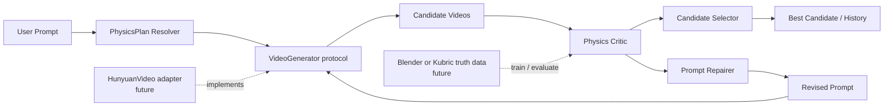
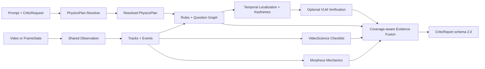

# PhysGenLoop

> 日期：2026-07-15
> 作者：sunyu

PhysGenLoop 是面向生成视频的物理一致性评估与反馈闭环。系统先把提示词解析为结构化 `PhysicsPlan`，再评估候选视频中的运动、接触、时序和力学一致性，输出可定位、可解释的 `CriticReport`，最后据此选择候选或生成下一轮修复提示。

## 项目定位

仓库包含两个边界清晰的 Python 包：

- `pavg_critic`：已经可以独立运行的 Physics Planner 与 Physics Critic；
- `physgenloop`：连接 Generator、Critic、Selector 和 Repairer 的有界 Best-of-K 编排层。

当前重点是建立可审计的物理评估基线和稳定闭环契约。真实 HunyuanVideo 生成服务、Blender/Kubric 数据生产和学习型 Repair Agent 尚未接入，仓库不会把这些规划项描述成已完成功能。

## 当前能力

| 层级 | 状态 | 当前实现 |
|---|---|---|
| Prompt → PhysicsPlan | 已实现 | 中英文模板、结构化模型、显式计划合并、provider 回退与诊断 |
| 视觉观测 | 已实现基础能力 | HSV 红色物体、通用 VLM 检测、可选 SAM2 跟踪后端 |
| Physics Critic | 已实现 | 轨迹与事件、确定性规则、PQSG、VideoScience、Morpheus、关键帧 VLM、证据融合 |
| Benchmark | 已实现 | 数据清单、缓存、基线、分组指标、诊断与可恢复运行器 |
| Loop orchestration | 框架已实现 | 冻结契约、fake generator、Repairer、Selector、有界 Best-of-K 控制器 |
| 真实视频生成 | 尚未实现 | 后续通过 `VideoGenerator` 协议接入 |
| 学习型 Repair / Critic | 尚未实现 | 当前 Repairer 聚合结构化修复指令，Critic 以规则和可选模型为主 |

## 整体闭环



一次循环的数据路径是：

```text
Prompt
  → resolved PhysicsPlan
  → Best-of-K candidate videos
  → CriticReport for each candidate
  → select current/history best
  → accepted / max_rounds / repaired next prompt
```

`LoopController` 用 `max_rounds` 和 `candidates_per_round` 限制搜索，不允许无限重试。每轮保留 prompt、seed、候选引用、CriticReport 和选择结果，便于复现与审计。

## 分层架构

| 层级 | 包或目录 | 职责 | 主要边界 |
|---|---|---|---|
| 闭环编排层 | `src/physgenloop/` | 生成、评估适配、修复、选择和停止条件 | `VideoGenerator`、`CandidateCritic`、`PromptRepairer`、`CandidateSelector` |
| 物理评估层 | `src/pavg_critic/` | 计划解析、感知、轨迹、规则、问题图、力学、VLM 与融合 | `CriticRequest` → `PhysicsCritic.analyze()` → `CriticReport` |
| 离线评测层 | `src/pavg_critic/benchmarking/`、`benchmarks/` | 数据清单、基线、指标、缓存、诊断和报告 | `BenchmarkSample`、`BenchmarkPrediction` |
| 契约与配置 | `schemas/`、`configs/`、`evaluation/` | 输出 schema、运行配置、冻结夹具和可移植清单 | JSON/YAML 元数据，不保存原始视频 |

依赖方向保持单向：`physgenloop` 通过 adapter 使用 `pavg_critic`，Physics Critic 不依赖闭环控制器；benchmark 调用公开评估接口，不修改核心运行语义。

## Physics Critic 数据流



核心数据契约按以下顺序流转：

```text
CriticRequest
  → PhysicsPlan
  → FrameState / TrackSequence / Event
  → ViolationCandidate
  → EvidenceBundle
  → CriticReport
```

视频观测在一次分析中共享，规则、问题图、检查表、力学和 VLM 尽量复用轨迹、事件和关键帧。无轨迹、无可回答问题且无适用力学证据时，系统返回 `unknown` 和中性分数，而不是伪造物理满分。

`schemas/critic_output.schema.json` 定义输出 schema 2.0：

- `decision`：`physical`、`violation` 或 `unknown`；
- `physics_score`：融合后的物理可信度，范围 `[0, 1]`；
- `confidence`：按证据覆盖率折减后的置信度；
- `violations`：异常对象、类别、时间区间、关键帧、理由和修复建议；
- `evidence_bundles`：规则、问题图、检查表、力学和 VLM 的独立证据；
- `diagnostics`：Planner、问题执行与 provider failure 等审计信息。

## 仓库结构

```text
PAVG/
├── src/
│   ├── pavg_critic/                 Physics Planner + Physics Critic
│   │   ├── benchmarking/            离线评测数据、基线、指标与报告
│   │   ├── planner.py               模板/模型 Planner 与 Resolver
│   │   ├── pipeline.py              Critic 主流水线
│   │   ├── detector.py              受控颜色检测前端
│   │   ├── vlm_detector.py          通用 VLM 检测前端
│   │   ├── sam2_detector.py         可选 SAM2 视频跟踪后端
│   │   ├── tracker.py               目标跟踪与身份管理
│   │   ├── event_detector.py        物理事件检测
│   │   ├── physics_rules.py         确定性物理规则
│   │   ├── vlm_verifier.py          关键帧多模态复核
│   │   └── evidence_fusion.py       覆盖感知证据融合
│   └── physgenloop/                 跨组件闭环编排
│       ├── contracts.py             循环配置、候选、轮次与结果
│       ├── interfaces.py            Generator/Critic/Repairer/Selector 协议
│       ├── generator.py             deterministic fake generator
│       ├── critic_adapter.py        PhysicsCritic 边界适配器
│       ├── repairer.py              修复指令聚合
│       ├── selector.py              稳定候选排序
│       └── controller.py            有界 Best-of-K 控制器
├── tests/                            单元、集成和回归测试
├── benchmarks/                       离线评测与诊断命令
├── evaluation/                       冻结夹具、清单和外部数据元数据
├── configs/                          Critic 默认配置
├── schemas/                          Critic 输出与样本契约
├── examples/
│   ├── evaluate_video.py             端到端视频评估入口
│   ├── critic_request.json           示例请求
│   └── observations.json             示例观测
└── docs/
    ├── archive/project-overview.pdf  早期项目总体思路
    ├── results/                       可审计实验结果
    └── superpowers/                   设计与实施计划
```

Git 只跟踪源码、测试、配置、schema、文档、示例和数据元数据。原始视频、模型权重、外部数据、生成输出、虚拟环境和真实 `.env` 均被忽略。

## 安装与环境配置

要求 Python 3.10+，推荐 Python 3.12 和独立虚拟环境：

```powershell
py -3.12 -m venv .venv
.\.venv\Scripts\Activate.ps1
python -m pip install -e ".[test]"
```

按需要安装可选依赖：

```powershell
# 视频解码
python -m pip install -e ".[video,test]"

# .env 文件加载
python -m pip install -e ".[env]"

# 当前仓库的常用开发组合
python -m pip install -e ".[env,video,test]"
```

`pyproject.toml` 是 Python 依赖的唯一声明源。CUDA、Torch、官方 SAM2、HunyuanVideo 和外部视觉模型根据部署环境单独安装。

需要模型 API 时，复制环境模板并填写本机值：

```powershell
Copy-Item .env.example .env
```

```env
API_KEY=
BASE_URL=https://api.openai.com/v1
VLM_MODEL=gpt-5-mini
TEXT_MODEL=gpt-5-mini
```

`BASE_URL` 使用 OpenAI Chat Completions 兼容格式，可指向官方 API、中转服务、vLLM 或提供同类接口的本地服务。`.env` 不得提交到 Git。

## 快速开始

### 1. 无 API 运行 Critic

仓库提供“下落—接触—反弹”的冻结观测，可跳过视频解码和模型调用：

```powershell
pavg-critic `
  --request examples/critic_request.json `
  --observations examples/observations.json `
  --config configs/default.yaml `
  --floor-y 100 `
  --output outputs/example_report.json
```

Python API：

```python
from pavg_critic import CriticRequest, PhysicsCritic, load_config
from pavg_critic.schemas import load_frame_states

critic = PhysicsCritic(load_config("configs/default.yaml"))
report = critic.analyze(
    CriticRequest.from_json("examples/critic_request.json"),
    observations=load_frame_states("examples/observations.json"),
    floor_y=100,
)
print(report.to_json())
```

### 2. Prompt 解析与结构化模型

不配置 API 时，`PhysicsCritic` 使用确定性中英文模板 Planner：

```python
from pavg_critic import CriticRequest, PhysicsCritic

critic = PhysicsCritic()
report = critic.analyze(
    CriticRequest(
        video_path="video.mp4",
        prompt="一个红球从桌面掉落，接触地面后反弹。",
    )
)
```

完整显式 `objects + expected_events` 会跳过 Planner 调用；部分显式计划保留非空核心字段，并补全空字段。所有下游模块共享 resolved request，解析诊断记录在 `diagnostics.planner`。

使用 Chat Completions 兼容模型：

```python
from pavg_critic import OpenAIChatModel, PhysicsCritic

vlm = OpenAIChatModel.from_env(model_env="VLM_MODEL")
text_model = OpenAIChatModel.from_env(model_env="TEXT_MODEL")
critic = PhysicsCritic(
    planner_model=text_model,
    question_model=text_model,
)
```

模型 Planner 超时、网络失败或返回非法 schema 时会记录 provider failure，并回退到模板 Planner；用户显式输入的非法计划不会被静默修复。

### 3. 端到端视频评估

`examples/evaluate_video.py` 使用 `VLMObjectDetector` 建立通用物体观测，然后执行完整 Critic 流程：

```powershell
# 无 prompt：VLM 通用检测 + Critic
python examples/evaluate_video.py --video video.mp4

# 有 prompt：Planner → VLM 检测 → Critic
python examples/evaluate_video.py `
  --video video.mp4 `
  --prompt "a red ball falls and bounces"

# 输出详细诊断 JSON
python examples/evaluate_video.py --video video.mp4 -v -o result.json
```

```text
VLM 代表帧检测
  → 关键帧 Detection 与 Tracker
  → 轨迹和事件
  → 规则、问题图、检查表与力学
  → VLM 关键帧复核
  → 证据融合与 JSON 报告
```

受控红球实验仍可使用 `ColorBlobDetector` 获取精确像素轨迹；通用 VLM 位置精度不等同于专用检测/分割模型或真值轨迹。

### 4. 最小闭环编排

下面的示例只验证控制流，不会生成真实 MP4：

```python
from pavg_critic.schemas import CriticReport
from physgenloop import (
    DeterministicFakeGenerator,
    EvidenceAwareSelector,
    InstructionPromptRepairer,
    LoopConfig,
    LoopController,
)


class AlwaysPhysicalCritic:
    def evaluate(self, candidate, *, prompt, physics_plan):
        return CriticReport(
            is_physical=True,
            decision="physical",
            physics_score=0.95,
            confidence=0.9,
        )


controller = LoopController(
    generator=DeterministicFakeGenerator(),
    critic=AlwaysPhysicalCritic(),
    repairer=InstructionPromptRepairer(),
    selector=EvidenceAwareSelector(),
    config=LoopConfig(max_rounds=3, candidates_per_round=2),
)
result = controller.run(prompt="A red ball falls and bounces.")
print(result.stop_reason, result.best.candidate.candidate_id)
```

接入真实生成器时，实现 `VideoGenerator.generate()` 并返回真实 `video_path`，再通过 `PhysicsCriticAdapter` 使用现有 Critic。

## 评测与结果

统一评测模式按能力递增：

| 模式 | 内容 | 模型/API |
|---|---|---|
| B0_PQSG | 官方 PQSG 独立输出 | 需要 |
| B1_RULE | PAVG 确定性物理规则 | 不需要 |
| M1_GRAPH | B1 + 模板问题图 | 不需要 |
| M2_CHECKLIST | M1 + VideoScience 检查表 | 不需要 |
| M3_MECHANICS | M2 + Morpheus 力学评估 | 不需要 |
| M4_VLM | M3 + 关键帧多模态复核 | 需要 |
| M5_FULL | M4 + 模型生成 PQSG 混合图 | 需要 |

```powershell
python benchmarks/evaluate_critic.py --mode B1_RULE
python benchmarks/evaluate_critic.py `
  --mode M3_MECHANICS `
  --output outputs/eval_m3.json
```

当前可审计 benchmark 过程、门控和结果见 [Critic benchmark 结果](docs/results/criticbenchmark.md)。仓库内小样例和 20 视频 smoke 集用于回归与架构诊断，不应单独作为论文级性能结论；更大规模 VideoPhy 评测按预注册计划执行。

## 测试

```powershell
$env:PYTHONPATH = "src"
.\.venv\Scripts\python.exe -m pytest -q
.\.venv\Scripts\python.exe -m compileall -q src tests benchmarks examples
.\.venv\Scripts\python.exe -m pip check
python -m json.tool evaluation/external_manifest.json > $null
```

如果 Windows 用户临时目录权限异常，可将 pytest 临时目录放在已忽略的缓存目录：

```powershell
New-Item -ItemType Directory -Force .pytest_cache | Out-Null
.\.venv\Scripts\python.exe -m pytest -q --basetemp=.pytest_cache\tmp
```

## 已知限制

- `DeterministicFakeGenerator` 只用于测试编排，不生成视频；
- `ColorBlobDetector` 只适用于受控 HSV 红色物体；
- `VLMObjectDetector` 可识别通用物体，但定位精度低于专用检测/分割模型；
- 图像坐标下的力学分数主要用于相对一致性评估，真实尺度需要相机标定、深度或真值轨迹；
- 当前 Prompt Repairer 只聚合 Critic 修复指令，不是学习型 Agent；
- B0、M4、M5 在缺少真实模型时不会伪造实验结果；
- 当前闭环是同步单机框架，不包含服务队列、GPU 调度或持久化数据库。

## 路线图

1. **当前：Planner + Critic + orchestration shell**
   - prompt-only PhysicsPlan；
   - 共享观测、混合 Critic 与证据融合；
   - 可复现 benchmark 与 deterministic Best-of-K 闭环。
2. **数据阶段：Blender/Kubric**
   - 正常与异常物理场景；
   - 逐帧轨迹、接触、时序区间和关键帧真值；
   - 数据版本、训练/验证/测试拆分。
3. **生成阶段：HunyuanVideo adapter**
   - 480p T2V/I2V 常驻服务；
   - seed、帧数、推理步数和输出路径控制；
   - 显存、超时和失败审计。
4. **闭环阶段：真实 Repair + Selector**
   - 结构化 repair prompt；
   - 多候选与多轮停止条件；
   - 语义保持、画质变化和新增错误率评估。
5. **研究阶段：训练与消融**
   - Critic 学习模块或 LoRA；
   - Direct / Physics-aware / Best-of-K / Feedback Loop 对比；
   - temporal IoU、关键帧命中率和修复成功率。

## 设计与开发文档

- [整体架构骨架设计](docs/superpowers/specs/2026-07-15-physgenloop-overall-architecture-design.md)
- [Prompt → PhysicsPlan Planner 设计](docs/superpowers/specs/2026-07-15-prompt-physics-plan-design.md)
- [Physics Critic 增强设计](docs/superpowers/specs/2026-07-14-pavg-critic-enhancement-design.md)
- [Critic benchmark 评测设计](docs/superpowers/specs/2026-07-15-critic-benchmark-evaluation-design.md)
- [仓库清理设计](docs/superpowers/specs/2026-07-16-repository-cleanup-design.md)
- [部署与操作指南](docs/operation-guide.md)
- [早期项目总体思路](docs/archive/project-overview.pdf)
